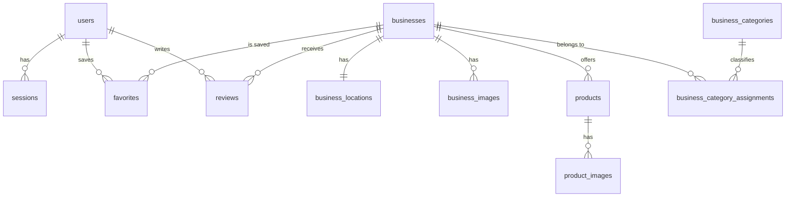

# Backend Data Model

## Estado del documento
Este documento es la version canonica del modelo de datos para backend. A partir de aqui se derivan:

- migraciones de base de datos,
- modelos ORM,
- seeds,
- contratos de `docs/backend/api-spec.md`,
- validaciones de negocio.

Si existe discrepancia con `data-model.md` en la raiz del proyecto, este archivo prevalece.

## Objetivos del modelo
- Soportar autenticacion, exploracion de negocios, favoritos, reseñas y perfil de usuario.
- Permitir filtros rapidos por categoria, zona, texto libre y cercania geografica.
- Habilitar fichas ricas de negocio con galeria, catalogo y CTA a WhatsApp.
- Mantener trazabilidad suficiente para sesiones, moderacion de reseñas y futura evolucion hacia panel de comerciantes.

## Supuestos de stack
- Base de datos: PostgreSQL 15+ (alineado con Render Postgres actual)
- Extension geografica: PostGIS
- Identificadores: UUID
- Fechas: `timestamptz`
- Busqueda textual: `tsvector` en español
- Storage de imagenes: S3-compatible; la base solo almacena URLs y metadatos

## Alineacion con estado actual
- Migraciones existentes: `0001_initial_schema.sql`, `0002_seed_core.sql`, `0003_seed_tepic_businesses.sql`, `0004_public_catalog_indexes.sql`.
- Las tablas, enums, indices parciales y triggers definidos aqui deben mantenerse compatibles con esas migraciones.
- Si hay divergencia, se corrige con nueva migracion incremental; no se edita una migracion ya aplicada.
- Estado real del seed `0003` a 2026-04-15: categorias, negocios, ubicaciones y asignaciones de categoria ya cargadas; galeria, productos y resenas aun no vienen precargadas.
- Implicacion MVP: el frontend debe soportar `images`, `products` y `reviews` vacios sin romper flujo de listado o detalle.

## Diagrama conceptual


## Enumeraciones

### `user_role`
- `customer`
- `owner`
- `admin`

### `business_status`
- `draft`
- `published`
- `suspended`

### `product_status`
- `active`
- `paused`
- `deleted`

### `review_status`
- `pending`
- `published`
- `rejected`

### `business_image_kind`
- `cover`
- `gallery`
- `menu`
- `stitch_ref`

## Entidades

### `users`
Cuenta principal de acceso para personas consumidoras, comerciantes y administradores.

| Campo | Tipo | Null | Regla |
| --- | --- | --- | --- |
| `id` | `uuid` | No | PK |
| `name` | `varchar(120)` | No | Nombre visible |
| `email` | `citext` | No | Unique |
| `phone` | `varchar(20)` | Si | Formato local o E.164 |
| `password_hash` | `varchar(255)` | No | Argon2 o bcrypt |
| `avatar_url` | `text` | Si | URL publica o firmada |
| `role` | `user_role` | No | Default `customer` |
| `last_login_at` | `timestamptz` | Si | Auditoria basica |
| `created_at` | `timestamptz` | No | Default `now()` |
| `updated_at` | `timestamptz` | No | Trigger de actualizacion |

Indices:
- unique `users_email_key` sobre `email`

### `sessions`
Persistencia de sesion para refresh tokens y cierre de sesion por dispositivo.

| Campo | Tipo | Null | Regla |
| --- | --- | --- | --- |
| `id` | `uuid` | No | PK |
| `user_id` | `uuid` | No | FK -> `users.id` |
| `refresh_token_hash` | `varchar(255)` | No | Nunca guardar token plano |
| `user_agent` | `text` | Si | Metadato de sesion |
| `ip_address` | `inet` | Si | Seguridad |
| `expires_at` | `timestamptz` | No | Expiracion |
| `created_at` | `timestamptz` | No | Default `now()` |

Reglas:
- `ON DELETE CASCADE` al eliminar usuario.

### `businesses`
Entidad principal del catalogo publico.

| Campo | Tipo | Null | Regla |
| --- | --- | --- | --- |
| `id` | `uuid` | No | PK |
| `name` | `varchar(160)` | No | Nombre comercial |
| `slug` | `citext` | No | Unique para URL |
| `description` | `text` | No | Descripcion larga |
| `phone` | `varchar(20)` | Si | Telefono general |
| `whatsapp_number` | `varchar(20)` | Si | Requerido para CTA |
| `email` | `varchar(120)` | Si | Contacto opcional |
| `website` | `text` | Si | URL externa |
| `address` | `text` | No | Direccion visible |
| `zone` | `varchar(120)` | No | Ej. `Centro`, `Flamingos` |
| `rating_avg` | `numeric(2,1)` | No | Default `0` |
| `rating_count` | `integer` | No | Default `0` |
| `is_verified` | `boolean` | No | Default `false` |
| `status` | `business_status` | No | Default `draft` |
| `created_at` | `timestamptz` | No | Default `now()` |
| `updated_at` | `timestamptz` | No | Trigger de actualizacion |

Indices:
- unique `businesses_slug_key` sobre `slug`
- `businesses_zone_idx` sobre `zone`
- `businesses_status_zone_idx` sobre `(status, zone)` para listado publicado por zona.
- GIN `businesses_tsv_idx` sobre `to_tsvector('spanish', coalesce(name,'') || ' ' || coalesce(description,''))`.

Reglas:
- Solo negocios `published` aparecen en listado publico.
- Para publicar un negocio se requiere `name`, `slug`, `description`, `address`, `zone`, al menos una categoria, una ubicacion y una imagen.
- Convencion de identificadores para API:
  - `slug` como identificador canonico en lectura publica.
  - `id` (uuid) tambien se acepta temporalmente via `{identifier}` por compatibilidad de clientes.
  - `id` (uuid) para mutaciones autenticadas (`favorites`, `reviews`).

### `business_locations`
Ubicacion geografica canonica del negocio para busqueda por cercania. En MVP se maneja una ubicacion por negocio, pero el diseno permite extenderse.

| Campo | Tipo | Null | Regla |
| --- | --- | --- | --- |
| `id` | `uuid` | No | PK |
| `business_id` | `uuid` | No | FK -> `businesses.id` |
| `latitude` | `numeric(10,6)` | No | Coordenada decimal |
| `longitude` | `numeric(10,6)` | No | Coordenada decimal |
| `geog_point` | `geography(point, 4326)` | No | Derivado de lat/lng |
| `opening_hours` | `jsonb` | Si | Horarios por dia |
| `pickup_available` | `boolean` | No | Default `false` |
| `created_at` | `timestamptz` | No | Default `now()` |
| `updated_at` | `timestamptz` | No | Trigger de actualizacion |

Indices:
- unique `business_locations_business_id_key` sobre `business_id`
- GIST `business_locations_geog_point_idx` sobre `geog_point`

Reglas:
- `business_id` es unico en MVP.
- `geog_point` debe mantenerse sincronizado con `latitude` y `longitude`.
- La busqueda "cerca de mi" usa `ST_DWithin`.

Estructura sugerida de `opening_hours`:
```json
{
  "monday": [{"open": "08:00", "close": "18:00"}],
  "tuesday": [{"open": "08:00", "close": "18:00"}],
  "sunday": []
}
```

Compatibilidad MVP:
- Se permite temporalmente `opening_hours` con shape heredado de seed OSM basado en un string de horario.
- El backend debe normalizar a formato legible para frontend, sin romper el shape sugerido canonico.

### `business_categories`
Catalogo curado de categorias visibles para filtros y clasificacion.

| Campo | Tipo | Null | Regla |
| --- | --- | --- | --- |
| `id` | `uuid` | No | PK |
| `slug` | `citext` | No | Unique |
| `name` | `varchar(80)` | No | Visible al usuario |
| `icon` | `varchar(80)` | Si | Token de iconografia |
| `created_at` | `timestamptz` | No | Default `now()` |

Indices:
- unique `business_categories_slug_key` sobre `slug`

### `business_category_assignments`
Relacion many-to-many entre negocio y categoria.

| Campo | Tipo | Null | Regla |
| --- | --- | --- | --- |
| `business_id` | `uuid` | No | FK -> `businesses.id` |
| `category_id` | `uuid` | No | FK -> `business_categories.id` |
| `relevance_score` | `smallint` | No | Default `1` |
| `assigned_at` | `timestamptz` | No | Default `now()` |

Clave primaria:
- `PRIMARY KEY (business_id, category_id)`

Indices:
- `business_category_assignments_category_business_idx` sobre `(category_id, business_id)` para filtro publico por categoria.

Reglas:
- Un negocio debe tener al menos una categoria para publicarse.
- `relevance_score` permite ordenar categoria principal frente a secundarias.

### `products`
Items destacados del negocio para enriquecer la ficha y la busqueda.

| Campo | Tipo | Null | Regla |
| --- | --- | --- | --- |
| `id` | `uuid` | No | PK |
| `business_id` | `uuid` | No | FK -> `businesses.id` |
| `sku` | `varchar(60)` | Si | Opcional |
| `name` | `varchar(160)` | No | Visible al usuario |
| `description` | `text` | Si | Descripcion corta o larga |
| `price` | `numeric(10,2)` | Si | Si aplica |
| `currency` | `char(3)` | No | Default `MXN` |
| `tags` | `text[]` | Si | Busqueda y clasificacion |
| `is_featured` | `boolean` | No | Default `false` |
| `status` | `product_status` | No | Default `active` |
| `created_at` | `timestamptz` | No | Default `now()` |
| `updated_at` | `timestamptz` | No | Trigger de actualizacion |

Indices:
- `products_business_id_idx` sobre `business_id`
- GIN `products_tags_idx` sobre `tags`
- GIN `products_tsv_idx` sobre `to_tsvector('spanish', coalesce(name,'') || ' ' || coalesce(description,''))`

Reglas:
- Solo productos `active` se muestran al usuario.
- En MVP, un negocio puede no tener productos y seguir publicandose.

### `product_images`
Galeria opcional de cada producto.

| Campo | Tipo | Null | Regla |
| --- | --- | --- | --- |
| `id` | `uuid` | No | PK |
| `product_id` | `uuid` | No | FK -> `products.id` |
| `image_url` | `text` | No | URL del medio |
| `alt_text` | `varchar(160)` | Si | Accesibilidad |
| `position` | `smallint` | No | Default `0` |

Reglas:
- `ON DELETE CASCADE` al eliminar producto.

### `business_images`
Galeria del negocio. Incluye portada, galeria, menus o referencias visuales temporales.

| Campo | Tipo | Null | Regla |
| --- | --- | --- | --- |
| `id` | `uuid` | No | PK |
| `business_id` | `uuid` | No | FK -> `businesses.id` |
| `image_url` | `text` | No | URL del medio |
| `caption` | `varchar(160)` | Si | Texto visible opcional |
| `kind` | `business_image_kind` | No | Default `gallery` |
| `position` | `smallint` | No | Default `0` |
| `source_reference` | `jsonb` | Si | Metadata de Stitch u origen |

Indices:
- `business_images_business_id_idx` sobre `business_id`
- `business_images_business_kind_position_idx` sobre `(business_id, kind, position)` para cover+galeria ordenada en detalle.

Reglas:
- Todo negocio publicado debe tener al menos una imagen.
- Debe existir como maximo una imagen `cover` por negocio en MVP.
- Las imagenes `stitch_ref` no deben llegar a produccion como contenido final.

### `favorites`
Relacion de guardado entre usuario y negocio.

| Campo | Tipo | Null | Regla |
| --- | --- | --- | --- |
| `user_id` | `uuid` | No | FK -> `users.id` |
| `business_id` | `uuid` | No | FK -> `businesses.id` |
| `created_at` | `timestamptz` | No | Default `now()` |

Clave primaria:
- `PRIMARY KEY (user_id, business_id)`

Reglas:
- No se permiten duplicados.
- Requiere sesion autenticada.

### `reviews`
Resenas de negocio en el modelo de datos. En el MVP vigente solo se consume lectura publica (`GET /businesses/{slug}/reviews`); la publicacion desde cliente queda Post-MVP.
Reseñas de usuarios sobre negocios.

| Campo | Tipo | Null | Regla |
| --- | --- | --- | --- |
| `id` | `uuid` | No | PK |
| `business_id` | `uuid` | No | FK -> `businesses.id` |
| `user_id` | `uuid` | No | FK -> `users.id` |
| `rating` | `smallint` | No | Check entre `1` y `5` |
| `comment` | `text` | Si | Comentario del usuario |
| `photos` | `text[]` | Si | URLs opcionales |
| `status` | `review_status` | No | Default `pending` |
| `visited_at` | `date` | Si | Fecha opcional |
| `created_at` | `timestamptz` | No | Default `now()` |
| `updated_at` | `timestamptz` | No | Trigger de actualizacion |

Indices:
- `reviews_business_created_idx` sobre `(business_id, created_at desc)`
- `reviews_published_business_created_idx` parcial sobre `(business_id, created_at desc) WHERE status = 'published'`
- `reviews_user_idx` sobre `user_id`

Reglas:
- Solo reseñas `published` afectan `rating_avg` y `rating_count`.
- Un usuario autenticado puede dejar multiples reseñas historicas solo si negocio lo permite en el futuro; para MVP se recomienda una reseña activa por usuario y negocio.

Restriccion recomendada MVP:
- unique parcial sobre `(business_id, user_id)` para reseñas con estado distinto de `rejected`.

## Reglas transversales

### Publicacion de negocio
Un negocio puede pasar a `published` solo si cumple:
- nombre,
- slug,
- descripcion,
- direccion,
- zona,
- `business_locations`,
- al menos una categoria,
- al menos una imagen visible.

### Busqueda publica
La capa publica solo debe devolver:
- negocios `published`,
- productos `active`,
- reseñas `published`.

### Geolocalizacion
Consulta recomendada:
```sql
ST_DWithin(
  business_locations.geog_point,
  ST_SetSRID(ST_MakePoint(:longitude, :latitude), 4326)::geography,
  :radius_meters
)
```

### WhatsApp
- `whatsapp_number` debe validarse antes de publicarse.
- El frontend no debe mostrar CTA activo si el numero no existe o es invalido.

### Favoritos y auth
- Todas las operaciones de favoritos requieren usuario autenticado.
- Las consultas publicas no requieren sesion salvo personalizacion como "guardado por mi".

## Indices adicionales sugeridos
- GIN sobre `businesses.search_vector` si en Post-MVP se materializa un vector combinado de `name`, `description`, `zone`.

## Triggers y automatizaciones recomendadas

### `set_updated_at`
Aplicar a:
- `users`
- `businesses`
- `business_locations`
- `products`
- `reviews`

### `sync_business_location_geog_point`
- Recalcula `geog_point` al insertar o actualizar `latitude` o `longitude`.

### `refresh_business_rating`
- Recalcula `rating_avg` y `rating_count` cuando cambia una reseña publicada.

## Orden recomendado de migraciones
1. extensiones (`citext`, `postgis`)
2. enums
3. `users`
4. `sessions`
5. `business_categories`
6. `businesses`
7. `business_locations`
8. `business_category_assignments`
9. `products`
10. `product_images`
11. `business_images`
12. `favorites`
13. `reviews`
14. indices avanzados y triggers

## Seeds minimos para staging y desarrollo
- Minimo ejecutable actual (cubierto por `0003`): 3 categorias, 5 negocios `published`, 1 ubicacion por negocio y zonas `Centro`, `Insurgentes`, `Colosio`, `La Loma`.
- Objetivo de seed para QA MVP (siguiente migracion incremental): imagenes de portada, productos destacados y resenas de ejemplo.
- Regla de compatibilidad: mientras el seed de QA no exista, los clientes deben mostrar placeholders cuando falte galeria, catalogo o resenas.

## Relacion con API
Este modelo debe reflejarse en:
- `GET /businesses`
- `GET /businesses/{slug}`
- `GET /categories`
- `POST /auth/register`
- `POST /auth/login`
- `POST /auth/refresh`
- `POST /auth/logout`
- `GET /me`
- `PATCH /me` (Post-MVP)
- `GET /favorites`
- `POST /favorites/{businessId}`
- `DELETE /favorites/{businessId}`
- `GET /businesses/{slug}/reviews`
- `POST /businesses/{businessId}/reviews` (Post-MVP)

## Decisiones cerradas para MVP
- `zone` se mantiene como texto controlado en `businesses.zone`; no se crea tabla `zones` en MVP.
- El login MVP es solo `email + password` con JWT (`access` + `refresh`), sin OTP.
- Si se habilita publicacion de resenas (Post-MVP), se crean en estado `pending` y solo `published` cuenta para rating visible.

## Capacidades Post-MVP documentadas
- Edicion de perfil (`PATCH /me`).
- Publicacion de resenas desde cliente (`POST /businesses/{businessId}/reviews`).
